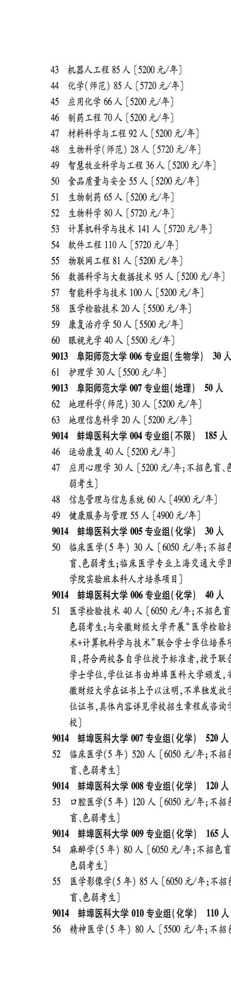
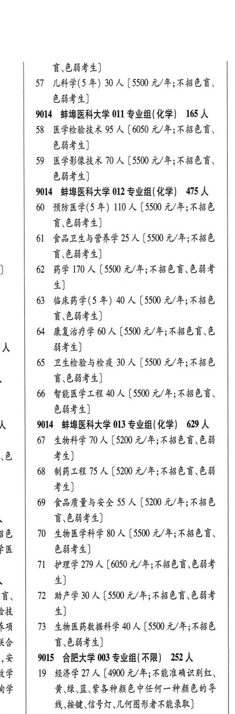

# 9014 蚌埠医科大学

- PDF页码：206
- 书内页码：255
- 专业组：10；专业条目：21

## 004专业组

- 选科要求：不限
- 招生计划：185 人
- 校验：ok

| 专业代码 | 专业名称 | 计划人数 | 学费（元/年） | 备注/完整OCR内容 |
|---|---|---:|---:|---|
| 46 | 运动康复 | 40 | 5200 | [5200元/年] |
| 47 | 应用心理学 | 30 | 5200 | 【5200 元/年;不招色言、 能考生] |
| 48 | 信息管理与信息系统 | 60 | 4900 | 【4900 元/年] |
| 49 | 健康服务与管理 | 55 | 4900 | 【4900 元/年] |

<details><summary>本专业组OCR原文</summary>

```text
9014 蚌埠医科大学 004 专业组(不限】 185 人
46 运动康复 40 人[5200元/年]
47 应用心理学 30 人【5200 元/年;不招色言、
能考生]
48 信息管理与信息系统 60 人【4900 元/年]
49 健康服务与管理 55 人【4900 元/年]
```
</details>

## 005专业组

- 选科要求：化学
- 招生计划：30 人
- 校验：review

| 专业代码 | 专业名称 | 计划人数 | 学费（元/年） | 备注/完整OCR内容 |
|---|---|---:|---:|---|
| 50 | 临床医学(5 年) 30 A ( |  | 6050 | 6050 元/年;不招 育\色弱考生;临床医学专业上海交通大学有 学院实验班本科人才培养项目] |

<details><summary>本专业组OCR原文</summary>

```text
9014 蚌埠医科大学 005 专业组(化学) 30 人
50 临床医学(5 年) 30 A (6050 元/年;不招
育\色弱考生;临床医学专业上海交通大学有
学院实验班本科人才培养项目]
```
</details>

## 006专业组

- 选科要求：化学
- 招生计划：40 人
- 校验：ok

| 专业代码 | 专业名称 | 计划人数 | 学费（元/年） | 备注/完整OCR内容 |
|---|---|---:|---:|---|
| 51 | 医学检验技术 | 40 | 6050 | 【6050 元/年;不招色计 色弱考生;与安徽财经大学开展"医学检验# 术+计算机科学与技术"联合学士学位培养 目,符合两校各自学位授予标准者,授予联人 学士学位,学位证书由蚌埠医科大学颁发,4 徽财经大学在证书上了予以注明,不单独发放“ 位证书,具体内容详见学校招生章程或咨询 校] |

<details><summary>本专业组OCR原文</summary>

```text
9014 蚌埠医科大学 006 专业组(化学) 40 人
51 医学检验技术 40 人【6050 元/年;不招色计
色弱考生;与安徽财经大学开展"医学检验#
术+计算机科学与技术"联合学士学位培养
目,符合两校各自学位授予标准者,授予联人
学士学位,学位证书由蚌埠医科大学颁发,4
徽财经大学在证书上了予以注明,不单独发放“
位证书,具体内容详见学校招生章程或咨询
校]
```
</details>

## 007专业组

- 选科要求：化学
- 招生计划：520 人
- 校验：sum-corrected

| 专业代码 | 专业名称 | 计划人数 | 学费（元/年） | 备注/完整OCR内容 |
|---|---|---:|---:|---|
| 52 | 临床医学(5 年) | 520 |  | 【6050 A/F; RB 盲、色弱考生] |

<details><summary>本专业组OCR原文</summary>

```text
9014 蚌埠医科大学 007 专业组( 化学) S20 人
52 临床医学(5 年) 520 人【6050 A/F; RB
盲、色弱考生]
```
</details>

## 008专业组

- 选科要求：化学
- 招生计划：120 人
- 校验：ok

| 专业代码 | 专业名称 | 计划人数 | 学费（元/年） | 备注/完整OCR内容 |
|---|---|---:|---:|---|
| 53 | 口腔医学(5 年) | 120 | 6050 | 【6050 元/年;不招t FGHF4) |

<details><summary>本专业组OCR原文</summary>

```text
9014 蚌埠医科大学 008 专业组(化学) 120 人
53 口腔医学(5 年) 120 人【6050 元/年;不招t
FGHF4)
```
</details>

## 009专业组

- 选科要求：化学
- 招生计划：165 人
- 校验：review

| 专业代码 | 专业名称 | 计划人数 | 学费（元/年） | 备注/完整OCR内容 |
|---|---|---:|---:|---|
| 54 | 麻醉学(5 年) | 80 | 6050 | 【6050 元/年;不招色请 6844) |
| 55 | 医学影像学(5 年) 854 ( |  | 6050 | 6050 元/年;不招 盲.色弱考生] |

<details><summary>本专业组OCR原文</summary>

```text
9014 ”蚌埠医科大学 009 专业组(化学) 165 人
54 麻醉学(5 年) 80 人【6050 元/年;不招色请
6844)
55 医学影像学(5 年) 854 (6050 元/年;不招
盲.色弱考生]
```
</details>

## 010专业组

- 选科要求：化学
- 招生计划：110 人
- 校验：ok

| 专业代码 | 专业名称 | 计划人数 | 学费（元/年） | 备注/完整OCR内容 |
|---|---|---:|---:|---|
| 56 | 精神医学(5 年) | 80 | 5500 | [5500 元/年;不招 讶.色弱考生] |
| 57 | 儿科学(5年) | 30 |  | [5500 4/4; BED, 色弱考生] |

<details><summary>本专业组OCR原文</summary>

```text
014 蚌埠医科大学 010 专业组(化学) 110 人
56 精神医学(5 年) 80 人[5500 元/年;不招
讶.色弱考生]
57 儿科学(5年) 30 人[5500 4/4; BED,
色弱考生]
```
</details>

## 011专业组

- 选科要求：化学
- 招生计划：165 人
- 校验：review

| 专业代码 | 专业名称 | 计划人数 | 学费（元/年） | 备注/完整OCR内容 |
|---|---|---:|---:|---|
| 58 | 医学检验技术 | 95 | 6050 | 【6050 元/年;不招色言、 色弱考生] |
| 59 | 医学影像技术 70 A ( |  | 5500 | 5500 元/年;不招色盲、 色弱考生] |

<details><summary>本专业组OCR原文</summary>

```text
9014 蚌埠医科大学 011 专业组(化学) 165 人
58 医学检验技术 95 人【6050 元/年;不招色言、
色弱考生]
59 医学影像技术 70 A (5500 元/年;不招色盲、
色弱考生]
```
</details>

## 012专业组

- 选科要求：化学
- 招生计划：475 人
- 校验：review

| 专业代码 | 专业名称 | 计划人数 | 学费（元/年） | 备注/完整OCR内容 |
|---|---|---:|---:|---|
| 60 | 预防医学(5 年) | 110 | 5500 | 【5500 元/年;不招色 育、色弱考生] |
| 61 | 食品卫生与营养学 | 25 | 5500 | [5500 元/年;不招色 讶,色弱考生] J 62 药学 170 A (5500 元/年;不招色盲色弱考 生] |
| 63 | 临床药学(5 年) | 40 | 5500 | 【5500 元/年;不招色 讶.色弱考生] 4 康复治疗学 60 人【5500 元/年;不招色言、色 人 能考生] |
| 65 | ”卫生检验与检疫 | 30 | 5500 | 【5500 元/年;不招色 Be844) |
| 66 | 智能医学工程 40 A ( |  | 5500 | 5500 元/年;不招色言、 色弱考生] |

<details><summary>本专业组OCR原文</summary>

```text
9014 蚌埠医科大学 012 专业组( 化学) 475 人
60 预防医学(5 年) 110 人【5500 元/年;不招色
育、色弱考生]
61 食品卫生与营养学 25 人[5500 元/年;不招色
讶,色弱考生]
J   62 药学 170 A (5500 元/年;不招色盲色弱考
生]
63 临床药学(5 年) 40 人【5500 元/年;不招色
讶.色弱考生]
4 康复治疗学 60 人【5500 元/年;不招色言、色
人     能考生]
65 ”卫生检验与检疫 30 人【5500 元/年;不招色
Be844)
66 智能医学工程 40 A (5500 元/年;不招色言、
色弱考生]
```
</details>

## 013专业组

- 选科要求：化学
- 招生计划：145 人
- 校验：sum-corrected

| 专业代码 | 专业名称 | 计划人数 | 学费（元/年） | 备注/完整OCR内容 |
|---|---|---:|---:|---|
| 67 | “生物科学 | 70 | 5200 | 【5200 元/年;不招色盲色弱 、色 考生] |
| 68 | 制药工程 | 75 | 5200 | 【5200 元/年;不招色盲、色弱 考生] 的 食品质量与安全 55 人【5200 元/年;不招色 盲\色弱考生] ab 10 生物医学科学 80 A (5500 元/年;不招色言、 色弱考生] Tl 护理学279 人【6050 元/年;不招色育、色弱考 4) Bh TL HEEB A (5500 元/年;不招色盲色弱考 8 a) FA 73 生物医药数据科学 40 A (5500 元/年;不招色 ee 育\色弱考生] |

<details><summary>本专业组OCR原文</summary>

```text
人   9014 蚌埠医科大学 013 专业组( 化学) 629 人
67 “生物科学 70 人【5200 元/年;不招色盲色弱
、色     考生]
68 制药工程75 人【5200 元/年;不招色盲、色弱
考生]
的 食品质量与安全 55 人【5200 元/年;不招色
盲\色弱考生]
ab   10 生物医学科学 80 A (5500 元/年;不招色言、
色弱考生]
Tl 护理学279 人【6050 元/年;不招色育、色弱考
4)
Bh TL HEEB A (5500 元/年;不招色盲色弱考
8     a)
FA   73 生物医药数据科学 40 A (5500 元/年;不招色
ee    育\色弱考生]
```
</details>

## 附：院校完整OCR原文

```text
--- PDF第206页（书内第255页），第1栏 ---
9014 蚌埠医科大学 004 专业组(不限】 185 人
46 运动康复 40 人[5200元/年]
47 应用心理学 30 人【5200 元/年;不招色言、
能考生]
48 信息管理与信息系统 60 人【4900 元/年]
49 健康服务与管理 55 人【4900 元/年]
9014 蚌埠医科大学 005 专业组(化学) 30 人
50 临床医学(5 年) 30 A (6050 元/年;不招
育\色弱考生;临床医学专业上海交通大学有
学院实验班本科人才培养项目]
9014 蚌埠医科大学 006 专业组(化学) 40 人
51 医学检验技术 40 人【6050 元/年;不招色计
色弱考生;与安徽财经大学开展"医学检验#
术+计算机科学与技术"联合学士学位培养
目,符合两校各自学位授予标准者,授予联人
学士学位,学位证书由蚌埠医科大学颁发,4
徽财经大学在证书上了予以注明,不单独发放“
位证书,具体内容详见学校招生章程或咨询
校]
9014 蚌埠医科大学 007 专业组( 化学) S20 人
52 临床医学(5 年) 520 人【6050 A/F; RB
盲、色弱考生]
9014 蚌埠医科大学 008 专业组(化学) 120 人
53 口腔医学(5 年) 120 人【6050 元/年;不招t
FGHF4)
9014 ”蚌埠医科大学 009 专业组(化学) 165 人
54 麻醉学(5 年) 80 人【6050 元/年;不招色请
6844)
55 医学影像学(5 年) 854 (6050 元/年;不招
盲.色弱考生]
014 蚌埠医科大学 010 专业组(化学) 110 人
56 精神医学(5 年) 80 人[5500 元/年;不招

--- PDF第206页（书内第255页），第2栏 ---
讶.色弱考生]
57 儿科学(5年) 30 人[5500 4/4; BED,
色弱考生]
9014 蚌埠医科大学 011 专业组(化学) 165 人
58 医学检验技术 95 人【6050 元/年;不招色言、
色弱考生]
59 医学影像技术 70 A (5500 元/年;不招色盲、
色弱考生]
9014 蚌埠医科大学 012 专业组( 化学) 475 人
60 预防医学(5 年) 110 人【5500 元/年;不招色
育、色弱考生]
61 食品卫生与营养学 25 人[5500 元/年;不招色
讶,色弱考生]
J   62 药学 170 A (5500 元/年;不招色盲色弱考
生]
63 临床药学(5 年) 40 人【5500 元/年;不招色
讶.色弱考生]
4 康复治疗学 60 人【5500 元/年;不招色言、色
人     能考生]
65 ”卫生检验与检疫 30 人【5500 元/年;不招色
Be844)
66 智能医学工程 40 A (5500 元/年;不招色言、
色弱考生]
人   9014 蚌埠医科大学 013 专业组( 化学) 629 人
67 “生物科学 70 人【5200 元/年;不招色盲色弱
、色     考生]
68 制药工程75 人【5200 元/年;不招色盲、色弱
考生]
的 食品质量与安全 55 人【5200 元/年;不招色
盲\色弱考生]
ab   10 生物医学科学 80 A (5500 元/年;不招色言、
色弱考生]
Tl 护理学279 人【6050 元/年;不招色育、色弱考
4)
Bh TL HEEB A (5500 元/年;不招色盲色弱考
8     a)
FA   73 生物医药数据科学 40 A (5500 元/年;不招色
ee    育\色弱考生]
```

## 源图


