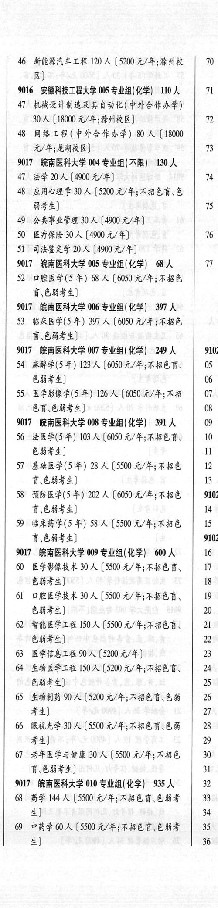
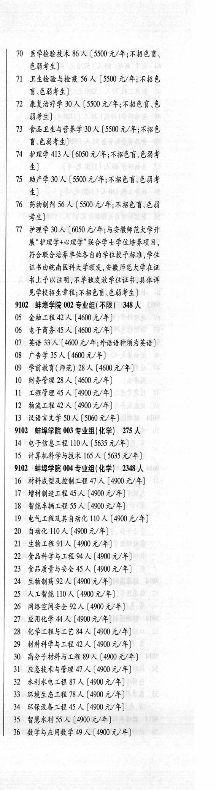

# 9017 皖南医科大学

- PDF页码：207
- 书内页码：256
- 专业组：7；专业条目：26

## 004专业组

- 选科要求：不限
- 招生计划：130 人
- 校验：ok

| 专业代码 | 专业名称 | 计划人数 | 学费（元/年） | 备注/完整OCR内容 |
|---|---|---:|---:|---|
| 47 | 法学 | 20 | 4900 | [4900元/年] 74 |
| 48 | 应用心理学 | 30 | 5200 | 【5200 元/年;不招色盲、色 BF) 7 |
| 49 | 公共事业管理 | 30 |  | 【4900 4/4) |
| 50 | 医疗保险 | 30 | 4900 | [4900元/年] 76 |
| 51 | 司法鉴定学 | 20 | 4900 | 【4900元/年] |

<details><summary>本专业组OCR原文</summary>

```text
9017 eA 004 专业组(不限】 130 人
47 法学20 人[4900元/年]           74
48 应用心理学 30 人【5200 元/年;不招色盲、色
BF)                  7
49 公共事业管理 30 人【4900 4/4)
50 医疗保险 30 人[4900元/年]         76
51 司法鉴定学 20 人【4900元/年]
```
</details>

## 005专业组

- 选科要求：化学
- 招生计划：68 人
- 校验：review

| 专业代码 | 专业名称 | 计划人数 | 学费（元/年） | 备注/完整OCR内容 |
|---|---|---:|---:|---|
| 52 | 口腔医学(5 年) 68 A ( |  | 6050 | 6050 元/年;不招色 讶\色弱考生] |

<details><summary>本专业组OCR原文</summary>

```text
9017 皖南医科大学 005 专业组(化学) 68 人    11
52 口腔医学(5 年) 68 A (6050 元/年;不招色
讶\色弱考生]
```
</details>

## 006专业组

- 选科要求：化学
- 招生计划：397 人
- 校验：review

| 专业代码 | 专业名称 | 计划人数 | 学费（元/年） | 备注/完整OCR内容 |
|---|---|---:|---:|---|
|  | 结构化OCR未稳定切分，请查看下方原文及源图 |  |  |  |

<details><summary>本专业组OCR原文</summary>

```text
9017 ENA S 006 专业组(化学) 397 人
533 临床医学(5 年) 397 人【6050 元/年;不招色
W684)
```
</details>

## 007专业组

- 选科要求：化学
- 招生计划：249 人
- 校验：review

| 专业代码 | 专业名称 | 计划人数 | 学费（元/年） | 备注/完整OCR内容 |
|---|---|---:|---:|---|
| 54 | 麻醉学(5 年) | 123 | 6050 | 【6050 元/年;不招色言、 05 : bHF4) 06 ， |
| 55 | 医学影像学(5 #) 126 A ( |  | 6050 | 6050 元/年;不招 01 : 色盲色弱考生] 08 |

<details><summary>本专业组OCR原文</summary>

```text
9017 RENAE 007 专业组(化学) 249 人   9102
54 麻醉学(5 年) 123 人【6050 元/年;不招色言、   05 :
bHF4)                06 ，
55医学影像学(5 #) 126 A (6050 元/年;不招   01 :
色盲色弱考生]              08
```
</details>

## 008专业组

- 选科要求：化学
- 招生计划：391 人
- 校验：review

| 专业代码 | 专业名称 | 计划人数 | 学费（元/年） | 备注/完整OCR内容 |
|---|---|---:|---:|---|
| 56 | 法医学(5 年) 103 A ( |  | 6050 | 6050 元/年;不招色育、 10 3 色弱考生] 让 |
| 57 | 基础医学(5 年) 28 A ( |  | 5500 | 5500 元/年;不招色 12 讶色弱考生] 13 |
| 58 | 预防医学(5 年) 202 A (6050 元/年;不招色 9102 讶,色弱考生] 14 ， 359 临床药学(5 年) | 58 | 6050 | 【5500 元/年;不招色 15 1 F684) 9102 |

<details><summary>本专业组OCR原文</summary>

```text
9017 皖南医科大学 008 专业组(化学) 391 人   09 |
56 法医学(5 年) 103 A (6050 元/年;不招色育、   10 3
色弱考生]               让
57 基础医学(5 年) 28 A (5500 元/年;不招色   12
讶色弱考生]              13
58 预防医学(5 年) 202 A (6050 元/年;不招色   9102
讶,色弱考生]               14 ，
359 临床药学(5 年) 58 人【5500 元/年;不招色   15 1
F684)               9102
```
</details>

## 009专业组

- 选科要求：化学
- 招生计划：600 人
- 校验：review

| 专业代码 | 专业名称 | 计划人数 | 学费（元/年） | 备注/完整OCR内容 |
|---|---|---:|---:|---|
| 60 | 医学影像技术 30 A (5500 4/4; 4B EF, 17 3 EHF) 18 4 |  |  | 60 医学影像技术 30 A (5500 4/4; 4B EF, 17 3 EHF) 18 4 |
| 61 | 口腔医学技术 30 A ( |  | 5500 | 5500 元/年;不招色盲、 19 。 色弱考生] 20 \| |
| 62 | 智能医学工程 150 A ( |  | 5500 | 5500 元/年;不招色育、 riba EHF) 2 |
| 63 | 医学信息工程 | 9 | 5200 | 【5200元/年] 23 1 |
| 64 | 生物医学工程 | 1530 | 5200 | 【5200 元/年;不招色育、 24 EHF 2) bey, |
| 65 | 生物制药 90 A ( |  | 5200 | 5200 元/年;不招色盲色弱 26 I #4) 7} |
| 66 | RAL FE | 30 | 5500 | 【5500 元/年;不招色盲色弱 28 1 考生] 29 4 |
| 67 | 老年医学与健康 | 30 | 5500 | 【5500 元/年;不招色 30 W684) 31 iy |

<details><summary>本专业组OCR原文</summary>

```text
9017 皖南医科大学 009 专业组(化学) 600 人   16 4
60 医学影像技术 30 A (5500 4/4; 4B EF,   17 3
EHF)                18 4
61 口腔医学技术 30 A (5500 元/年;不招色盲、   19 。
色弱考生]               20 |
62 智能医学工程 150 A (5500 元/年;不招色育、   riba
EHF)                 2
63 医学信息工程 9 人【5200元/年]       23 1
64 生物医学工程 1530 人【5200 元/年;不招色育、   24
EHF 2)                bey,
65 生物制药 90 A (5200 元/年;不招色盲色弱   26 I
#4)                7}
66 RAL FE 30 人【5500 元/年;不招色盲色弱   28 1
考生]                  29 4
67 老年医学与健康 30 人【5500 元/年;不招色   30
W684)               31 iy
```
</details>

## 010专业组

- 选科要求：化学
- 招生计划：935 人
- 校验：review

| 专业代码 | 专业名称 | 计划人数 | 学费（元/年） | 备注/完整OCR内容 |
|---|---|---:|---:|---|
| 68 | 药学 | 144 | 5500 | 【5500 元/年;不招色盲、色弱考 33 生] 34 5 |
| 69 | 中药学 60 A ( |  | 5500 | 5500 元/年;不招色盲、色弱考 35 4 4) 36 3 |
| 10 | 医学检验技术 86 A (5500 元/年;不招色盲、 6844) Tl 卫生检验与检疫 56 A (5500 元/年;不招色 W684) TL 康复治疗学 | 30 | 5500 | 【5500 元/年;不招色育、色 能考生] |
| 73 | 食品卫生与营养学 | 30 | 5500 | 【5500 元/年;不招色 讶.色弱考生] |
| 74 | 护理学 | 413 | 6050 | 【6050 元/年;不招色育、色弱考 生] |
| 75 | BER 30 A ( |  | 5500 | 5500 元/年;不招色育、色弱考 4) |
| 16 | 药物制剂 56 A (5500 元/年;不招色盲\色弱 考生] Tl 护理学 | 30 | 5500 | 【6050 元/年;与安徽师范大学开 展"护理学+心理学"联合学士学位培养项目， 符合联合培养单位各自的学位授予标准,学位 证书由皖南医科大学颁发,安徽师范大学在证 书上予以注骨,不单独发放学位证书，具体详 见学校招生章程;不招色盲色弱考生] |

<details><summary>本专业组OCR原文</summary>

```text
9017 皖南医科大学 010 专业组(化学) 935 人   32 7
68 药学 144 人【5500 元/年;不招色盲、色弱考   33
生]                    34 5
69 中药学 60 A (5500 元/年;不招色盲、色弱考   35 4
4)                    36 3
10 医学检验技术 86 A (5500 元/年;不招色盲、
6844)
Tl 卫生检验与检疫 56 A (5500 元/年;不招色
W684)
TL 康复治疗学 30 人【5500 元/年;不招色育、色
能考生]
73 食品卫生与营养学 30 人【5500 元/年;不招色
讶.色弱考生]
74 护理学 413 人【6050 元/年;不招色育、色弱考
生]
75 BER 30 A (5500 元/年;不招色育、色弱考
4)
16 药物制剂 56 A (5500 元/年;不招色盲\色弱
考生]
Tl 护理学 30 人【6050 元/年;与安徽师范大学开
展"护理学+心理学"联合学士学位培养项目，
符合联合培养单位各自的学位授予标准,学位
证书由皖南医科大学颁发,安徽师范大学在证
书上予以注骨,不单独发放学位证书，具体详
见学校招生章程;不招色盲色弱考生]
```
</details>

## 附：院校完整OCR原文

```text
--- PDF第207页（书内第256页），第2栏 ---
9017 eA 004 专业组(不限】 130 人
47 法学20 人[4900元/年]           74
48 应用心理学 30 人【5200 元/年;不招色盲、色
BF)                  7
49 公共事业管理 30 人【4900 4/4)
50 医疗保险 30 人[4900元/年]         76
51 司法鉴定学 20 人【4900元/年]
9017 皖南医科大学 005 专业组(化学) 68 人    11
52 口腔医学(5 年) 68 A (6050 元/年;不招色
讶\色弱考生]
9017 ENA S 006 专业组(化学) 397 人
533 临床医学(5 年) 397 人【6050 元/年;不招色
W684)
9017 RENAE 007 专业组(化学) 249 人   9102
54 麻醉学(5 年) 123 人【6050 元/年;不招色言、   05 :
bHF4)                06 ，
55医学影像学(5 #) 126 A (6050 元/年;不招   01 :
色盲色弱考生]              08
9017 皖南医科大学 008 专业组(化学) 391 人   09 |
56 法医学(5 年) 103 A (6050 元/年;不招色育、   10 3
色弱考生]               让
57 基础医学(5 年) 28 A (5500 元/年;不招色   12
讶色弱考生]              13
58 预防医学(5 年) 202 A (6050 元/年;不招色   9102
讶,色弱考生]               14 ，
359 临床药学(5 年) 58 人【5500 元/年;不招色   15 1
F684)               9102
9017 皖南医科大学 009 专业组(化学) 600 人   16 4
60 医学影像技术 30 A (5500 4/4; 4B EF,   17 3
EHF)                18 4
61 口腔医学技术 30 A (5500 元/年;不招色盲、   19 。
色弱考生]               20 |
62 智能医学工程 150 A (5500 元/年;不招色育、   riba
EHF)                 2
63 医学信息工程 9 人【5200元/年]       23 1
64 生物医学工程 1530 人【5200 元/年;不招色育、   24
EHF 2)                bey,
65 生物制药 90 A (5200 元/年;不招色盲色弱   26 I
#4)                7}
66 RAL FE 30 人【5500 元/年;不招色盲色弱   28 1
考生]                  29 4
67 老年医学与健康 30 人【5500 元/年;不招色   30
W684)               31 iy
9017 皖南医科大学 010 专业组(化学) 935 人   32 7
68 药学 144 人【5500 元/年;不招色盲、色弱考   33
生]                    34 5
69 中药学 60 A (5500 元/年;不招色盲、色弱考   35 4
4)                    36 3

--- PDF第207页（书内第256页），第3栏 ---
10 医学检验技术 86 A (5500 元/年;不招色盲、
6844)
Tl 卫生检验与检疫 56 A (5500 元/年;不招色
W684)
TL 康复治疗学 30 人【5500 元/年;不招色育、色
能考生]
73 食品卫生与营养学 30 人【5500 元/年;不招色
讶.色弱考生]
74 护理学 413 人【6050 元/年;不招色育、色弱考
生]
75 BER 30 A (5500 元/年;不招色育、色弱考
4)
16 药物制剂 56 A (5500 元/年;不招色盲\色弱
考生]
Tl 护理学 30 人【6050 元/年;与安徽师范大学开
展"护理学+心理学"联合学士学位培养项目，
符合联合培养单位各自的学位授予标准,学位
证书由皖南医科大学颁发,安徽师范大学在证
书上予以注骨,不单独发放学位证书，具体详
见学校招生章程;不招色盲色弱考生]
```

## 源图


