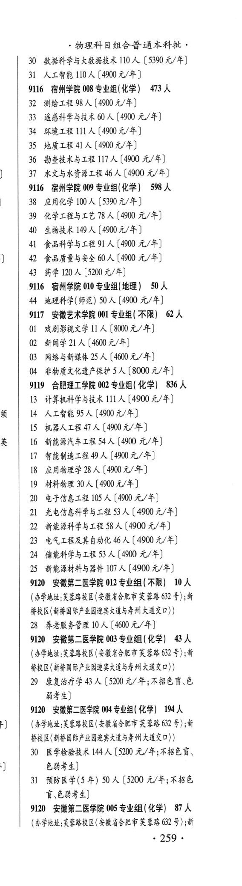
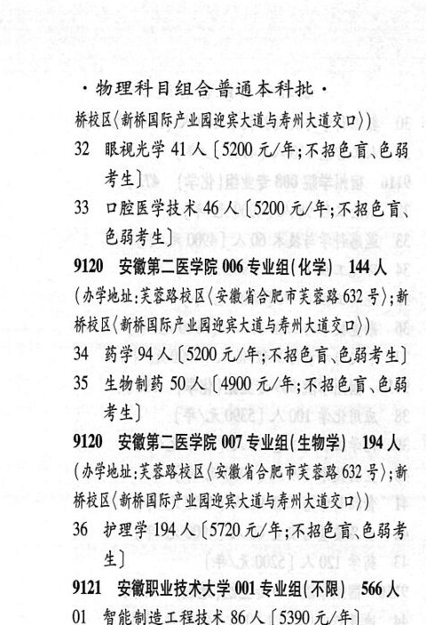

# 9120 安徽第二医学院

- PDF页码：210, 211
- 书内页码：259, 260
- 专业组：6；专业条目：9

## 003专业组

- 选科要求：化学
- 招生计划：3 人
- 校验：sum-corrected

| 专业代码 | 专业名称 | 计划人数 | 学费（元/年） | 备注/完整OCR内容 |
|---|---|---:|---:|---|
| 29 | 康复治疗学 | 3 | 5200 | 【5200 元/年;不招色盲、色 B44) |

<details><summary>本专业组OCR原文</summary>

```text
9120 安徽第二医学院 003 专业组 (化学) 43 人
29 康复治疗学 3 人【5200 元/年;不招色盲、色
B44)
```
</details>

## 004专业组

- 选科要求：化学
- 招生计划：194 人
- 校验：review

| 专业代码 | 专业名称 | 计划人数 | 学费（元/年） | 备注/完整OCR内容 |
|---|---|---:|---:|---|
| 30 | 医学检验技术 144 A ( |  | 5200 | 5200 元/年;不招色盲、 色弱考生] |
| 31 | 预防医学(5 年) | 50 | 5200 | 【5200 元/年;不招色 盲\色弱考生] |

<details><summary>本专业组OCR原文</summary>

```text
9120 安徽第二医学院 004 专业组( 化学) 194 人
30 医学检验技术 144 A (5200 元/年;不招色盲、
色弱考生]
31 预防医学(5 年) 50 人【5200 元/年;不招色
盲\色弱考生]
```
</details>

## 005专业组

- 选科要求：化学
- 招生计划：87 人
- 校验：review

| 专业代码 | 专业名称 | 计划人数 | 学费（元/年） | 备注/完整OCR内容 |
|---|---|---:|---:|---|
| 32 | 腿视光学 41 A ( |  | 5200 | 5200 元/年;不招色盲、色弱 考生] |
| 33 | 口腔医学技术 | 46 | 5200 | 【5200 元/年;不招色育、 色弱考生] |

<details><summary>本专业组OCR原文</summary>

```text
9120 安徽第二医学院 005 专业组(化学) 87 人
(办学地址:英莹路校区(安徽省合肥市黄蓉路 632 号) ;新
259 -
物理科目组合普通本科批，
FRE (HORA LORSALS FNAB)
32 腿视光学 41 A (5200 元/年;不招色盲、色弱
考生]
33 口腔医学技术 46 人【5200 元/年;不招色育、
色弱考生]
```
</details>

## 006专业组

- 选科要求：化学
- 招生计划：144 人
- 校验：ok

| 专业代码 | 专业名称 | 计划人数 | 学费（元/年） | 备注/完整OCR内容 |
|---|---|---:|---:|---|
| 34 | 药学 | 94 | 5200 | [5200 元/年;不招色盲色弱考生] |
| 35 | 生物制药 | 50 | 4900 | 【4900 元/年;不招色盲、色弱 考生] |

<details><summary>本专业组OCR原文</summary>

```text
9120 安徽第二医学院 006 专业组(化学) 144 人
34 药学94 人[5200 元/年;不招色盲色弱考生]
35 生物制药 50 人【4900 元/年;不招色盲、色弱
考生]
```
</details>

## 007专业组

- 选科要求：生物学
- 招生计划：194 人
- 校验：review

| 专业代码 | 专业名称 | 计划人数 | 学费（元/年） | 备注/完整OCR内容 |
|---|---|---:|---:|---|
| 36 | 护理学 194 A (5720 A/F; ABER EBS 生 |  |  | 36 护理学 194 A (5720 A/F; ABER EBS 生] |

<details><summary>本专业组OCR原文</summary>

```text
9120 安徽第二医学院 007 专业组( 生物学) 194 人
36 护理学 194 A (5720 A/F; ABER EBS
生]
```
</details>

## 012专业组

- 选科要求：不限
- 招生计划：10 人
- 校验：ok

| 专业代码 | 专业名称 | 计划人数 | 学费（元/年） | 备注/完整OCR内容 |
|---|---|---:|---:|---|
| 28 | 养老服务管理 | 10 | 4600 | 【4600 元/年] |

<details><summary>本专业组OCR原文</summary>

```text
9120 安徽第二医学院 012 专业组 (不限】 10 人
28 养老服务管理 10 人【4600 元/年]
```
</details>

## 附：院校完整OCR原文

```text
--- PDF第210页（书内第259页），第3栏 ---
9120 安徽第二医学院 012 专业组 (不限】 10 人
(APRA: FERRE (SMASH RE 62 号) ;新
桥校区(新桥国际产业园迎宾大道与寿州大道交口) )
28 养老服务管理 10 人【4600 元/年]
9120 安徽第二医学院 003 专业组 (化学) 43 人
(办学地址;英莹路校区(安徽省合肥市黄蓉路 632 号) ;新
桥校区(新桥国际产业园迎宾大道与考州大道交口) )
29 康复治疗学 3 人【5200 元/年;不招色盲、色
B44)
9120 安徽第二医学院 004 专业组( 化学) 194 人
(办学地址:革莹路校区(安徽省合肥市英莹路 632 号) ;新
桥校区(新桥国际产业国迎宾大道与考州大道交口))
30 医学检验技术 144 A (5200 元/年;不招色盲、
色弱考生]
31 预防医学(5 年) 50 人【5200 元/年;不招色
盲\色弱考生]
9120 安徽第二医学院 005 专业组(化学) 87 人
(办学地址:英莹路校区(安徽省合肥市黄蓉路 632 号) ;新
259 -

--- PDF第211页（书内第260页），第1栏 ---
物理科目组合普通本科批，
FRE (HORA LORSALS FNAB)
32 腿视光学 41 A (5200 元/年;不招色盲、色弱
考生]
33 口腔医学技术 46 人【5200 元/年;不招色育、
色弱考生]
9120 安徽第二医学院 006 专业组(化学) 144 人
(AFRE:REBRE (LMHS AR ER 632 号) ;新
桥校区(新桥国际产业加加宾大道与者州大道交口))
34 药学94 人[5200 元/年;不招色盲色弱考生]
35 生物制药 50 人【4900 元/年;不招色盲、色弱
考生]
9120 安徽第二医学院 007 专业组( 生物学) 194 人
(办学地址;甘蓝路校区(安徽省合肥市英蓉路 632 号) ;新
FRE HOP LERRALS HAR)
36 护理学 194 A (5720 A/F; ABER EBS
生]
```

## 源图


