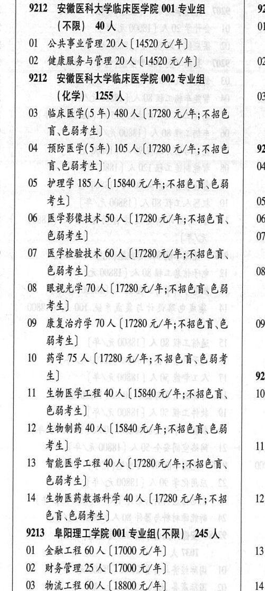

# 9212 安徽医科大学临床医学院

- PDF页码：213
- 书内页码：262
- 专业组：2；专业条目：14

## 001专业组

- 选科要求：OCR未稳定识别
- 招生计划：4 人
- 校验：review

| 专业代码 | 专业名称 | 计划人数 | 学费（元/年） | 备注/完整OCR内容 |
|---|---|---:|---:|---|
| 01 | 公共事业管理 20 ( |  | 14520 | 14520 元/年] |
| 02 | 健康服务与管理 | 20 | 14520 | 【14520 元/年] 0 |

<details><summary>本专业组OCR原文</summary>

```text
%12 安徽医科大学临床医学院 001 专业组     921 (ARR) 4 人             01
01 公共事业管理 20 (14520 元/年]
02 健康服务与管理 20 人【14520 元/年]      0
```
</details>

## 002专业组

- 选科要求：化学
- 招生计划：1255 人
- 校验：review

| 专业代码 | 专业名称 | 计划人数 | 学费（元/年） | 备注/完整OCR内容 |
|---|---|---:|---:|---|
| 03 | 临床医学(5 年) | 480 | 17280 | 【17280 元/年;不招色 言\色弱考生] |
| 04 | 预防医学(5年) | 105 | 17280 | 【17280 元/年;不招色 921 盲,色弱考生] 4 |
| 05 | 护理学 185 A (15840 4/4; RBER EB #4) 05 |  |  | 05 护理学 185 A (15840 4/4; RBER EB #4) 05 |
| 06 | 医学影像技术 50 A (17280 4/4; 488 B, 06 色弱考生] 07 |  |  | 06 医学影像技术 50 A (17280 4/4; 488 B, 06 色弱考生] 07 |
| 07 | 医学检验技术 | 60 | 17280 | 【17280 元/年;不招色育、 E844) 08 |
| 08 | RAF 710A (17280 4/4; FRED EB #4) |  |  | 08 RAF 710A (17280 4/4; FRED EB #4) |
| 09 | 康复治疗学 | 70 |  | 【17280 4/#;FBEHE 09 弱考生] |
| 10 | 药学 | 75 | 17280 | 【17280 元/年;不招色盲色弱考 本] 921 |
| 11 | 生物医学工程 | 40 | 15840 | 【15840元/年;不招色言、 10 &84F4) |
| 12 | 生物制药 | 40 |  | 【15840 4/4; BER EB 考生] 11 |
| 13 | 智能医学工程 | 40 | 17280 | 【17280元/年;不招色育、 EHF) |
| 14 | 生物医药数据科学 40 A ( |  | 17280 | 17280 元/年;不招 12 EH EHF4) |

<details><summary>本专业组OCR原文</summary>

```text
9212 安徽医科大学临床医学院 002 专业组 (化学) 1255人           03
03 临床医学(5 年) 480 人【17280 元/年;不招色
言\色弱考生]
04 预防医学(5年) 105 人【17280 元/年;不招色   921
盲,色弱考生]               4
05 护理学 185 A (15840 4/4; RBER EB
#4)                   05
06 医学影像技术 50 A (17280 4/4; 488 B,   06
色弱考生]                 07
07 医学检验技术 60 人【17280 元/年;不招色育、
E844)                 08
08 RAF 710A (17280 4/4; FRED EB
#4)
09 康复治疗学70 人【17280 4/#;FBEHE   09
弱考生]
10 药学75 人【17280 元/年;不招色盲色弱考
本]                    921
11 生物医学工程 40 人【15840元/年;不招色言、   10
&84F4)
12 生物制药 40 人【15840 4/4; BER EB
考生]                   11
13 智能医学工程 40 人【17280元/年;不招色育、
EHF)
14 生物医药数据科学 40 A (17280 元/年;不招   12
EH EHF4)
```
</details>

## 附：院校完整OCR原文

```text
--- PDF第213页（书内第262页），第2栏 ---
%12 安徽医科大学临床医学院 001 专业组     921
(ARR) 4 人             01
01 公共事业管理 20 (14520 元/年]
02 健康服务与管理 20 人【14520 元/年]      0
9212 安徽医科大学临床医学院 002 专业组
(化学) 1255人           03
03 临床医学(5 年) 480 人【17280 元/年;不招色
言\色弱考生]
04 预防医学(5年) 105 人【17280 元/年;不招色   921
盲,色弱考生]               4
05 护理学 185 A (15840 4/4; RBER EB
#4)                   05
06 医学影像技术 50 A (17280 4/4; 488 B,   06
色弱考生]                 07
07 医学检验技术 60 人【17280 元/年;不招色育、
E844)                 08
08 RAF 710A (17280 4/4; FRED EB
#4)
09 康复治疗学70 人【17280 4/#;FBEHE   09
弱考生]
10 药学75 人【17280 元/年;不招色盲色弱考
本]                    921
11 生物医学工程 40 人【15840元/年;不招色言、   10
&84F4)
12 生物制药 40 人【15840 4/4; BER EB
考生]                   11
13 智能医学工程 40 人【17280元/年;不招色育、
EHF)
14 生物医药数据科学 40 A (17280 元/年;不招   12
EH EHF4)
```

## 源图

